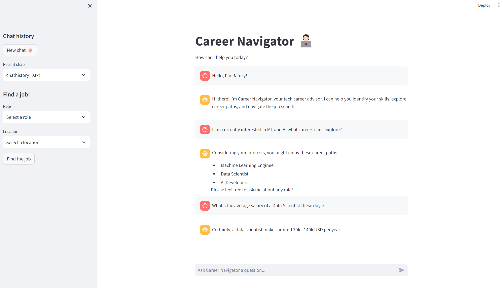
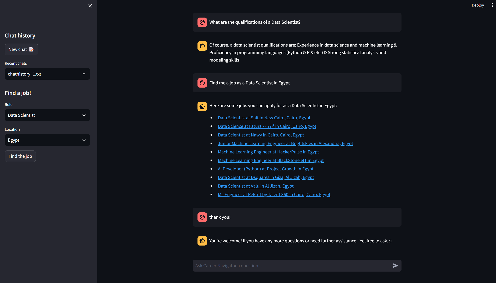

# Career-Navigator-Chatbot


**Career-Navigator** is your indispensable companion for navigating the intricate landscape of the tech job market. With Scala powering its robust backend and Python driving its sleek frontend interface, Career-Navigator offers a seamless user experience, ensuring you stay ahead in your job search journey.

Designed with precision and efficiency in mind, Career-Navigator serves as your personal guide, providing tailored insights, expert advice, and real-time updates to help you navigate the complexities of the ever-evolving tech industry. Whether you're a seasoned professional seeking new opportunities or a fresh graduate embarking on your career path, Career-Navigator is equipped to assist you at every step of the way.




## How to Use:

1. **Start the convo!:**
   - Start a conversation by letting Career Navigator know about your skills and interests.

2. **Get to know more about a Role:**
   - Try and ask about a role salary, qualification, description, or responsibility.

3. **Find a Job:**
   - Use the drop-down menus on your left to find real-world job postings for a selected role on Linkedln using the power of webscapping.

## Installation & Requirements

1. **Clone the repository to your machine.**
2. Install Scala 3, Python, and the required packages and libraries by running the following command:
  ```
  pip install -r requirements.txt
  ```
3. **How to run:**
- Run the following commands in order:
  ```
  scalac chatbot.scala
  ```
  ```
  scala chatbot.scala
  ```
  ```
  streamlit run app.py
  ```
## Our team:
  - [@RamzyBakir](https://github.com/RamzyBakir)
  - [@YahiaSonbol](https://github.com/YahiaSonbol)
  - [@medo3alaa](https://github.com/medo3alaa)
  - [@YoussefHazem](https://github.com/youssefeLsharaawy)
